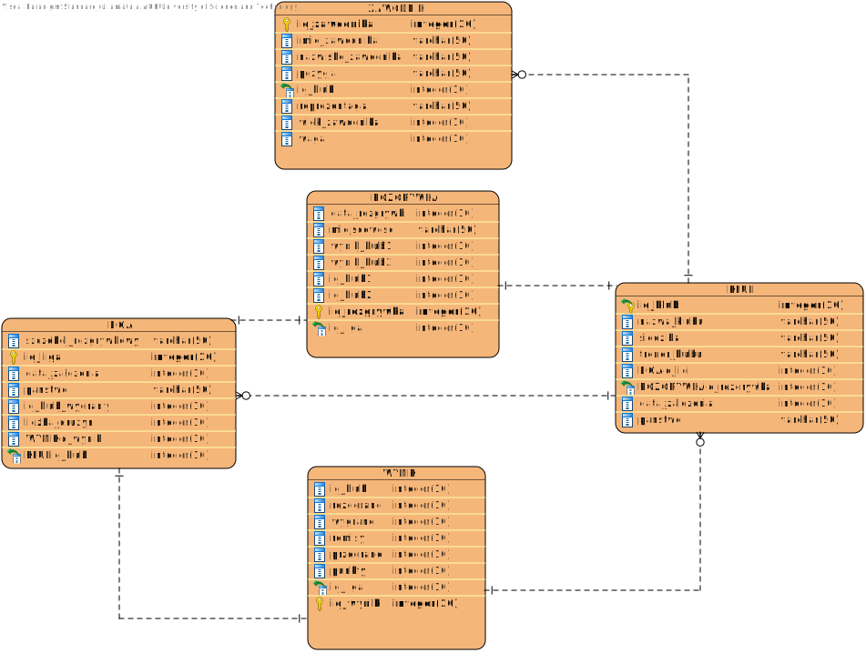

# Rozgrywki piłki nożnej 
>Na przedmiocie Bazy Danych zrealizowany został projekt dwuosobowy, którego celem było zaprojektowanie oraz implementacja systemu bazodanowego. 

| Nazwisko i imię | Wydział | Kierunek | Semestr | Grupa | Rok akademicki |
| :-------------: | :-----: | :------: | :-----: | :---: | :------------: |
| Urszula Piątek         | WIMiIP  | IS       |   4     | 3     | 2019/2020      |
| Julia Matuła         | WIMiIP  | IS       |   4     | 3    | 2019/2020      |

## Projekt bazy danych
Temat projektu jaki został nam przydzielony to _,,Rozgrywki piłki nożnej"_. W celu zobrazowania funkcjonalności bazy, która została przez nas zaplanowana stworzony został diagram. Do stworzenia poniższego diagramu skorzystałyśmy z progarmu **Visual Paradigm**. 



Przy użyciu **XAMPP** oraz  **phpMyAdmin** mogłyśmy w łatwy sposób stworzyć naszą bazą danych. W pierwszej kolejności została stworzona baza wraz z tabelkami. Do stworzenia tabelek wykorzystane zostały zapytania **DDL**. DDL są to zapytania służące do operowania na strukturach, dzięki nim można dodać, zmienić lub skaskować tabele lub bazy. W każdej tabeli dodany został klucz główny, w celu identyfikacji każdego rekordu.  Przykładowe zapytania służace do stworzenia poszczególnych tabel: 

Kluczem prywatnym w tabeli klub jest _id_klub_.

```sql 
CREATE TABLE `klub` (
  `id_klub` int(11) NOT NULL,
  `nazwa_klubu` varchar(50) NOT NULL,
  `siedziba` varchar(50) DEFAULT NULL,
  `trener_klubu` varchar(50) DEFAULT NULL,
  `data_zalozenia` int(11) DEFAULT NULL,
  `panstwo` varchar(50) DEFAULT NULL
) ENGINE=InnoDB DEFAULT CHARSET=utf8mb4;
```

W tabeli liga stworzony został klucz obcy _id_klub_wygrany_, w celu stworzenia powiązania tabeli _liga_ z tabelą _klub_.

```sql 
CREATE TABLE `liga` (
  `id_liga` int(11) NOT NULL,
  `szczebel_rozgrywkowy` varchar(50) NOT NULL,
  `data_zalozenia` date NOT NULL,
  `panstwo` varchar(50) DEFAULT NULL,
  `liczba_druzyn` int(11) DEFAULT NULL,
  `id_klub_wygrany` int(11) DEFAULT NULL
) ENGINE=InnoDB DEFAULT CHARSET=utf8mb4;
```

## Implementacja zapytań SQL
Po pomyślnej implementacji przeszłyśmy do uzupełnienia tabel rekordami. Rozpoczęłyśmy od tabeli _Klub_, ponieważ zawiera klucz obcy znajdujący się w tabeli Zawodnik. Tym samym można było przejść do wypełnienia tabeli Zawodnik, a następnie pozostałych tabel. 
W celu uzupełnienia tabel skorzystałyśmy z zapytań grupy **DML**. Przykładowe zapytanie:

Umieszczenie danych w tabeli _Rozgrywka_. 

```sql
INSERT INTO `rozgrywka` (`id_rozgrywka`, `data_rozgrywki`, `miejscowosc`, `id_klub1`, `id_klub2`, `wynik_klub1`, `wynik_klub2`, `id_liga`) VALUES
(1, '2020-03-07 18:30:00', 'Barcelona', 33, 37, 1, 0, 11);
```

Umieszczenie danych w tabeli _Zawodnik_. 

```sql
INSERT INTO `zawodnik` (`id_zawodnik`, `imie_zawodnika`, `nazwisko_zawodnika`, `pozycja`, `reprezentacja`, `wiek_zawodnika`, `id_klub`, `waga`) VALUES
(1, 'Radoslaw', 'Majecki', 'bramkarz', 'Polska', 21, 1, 78),
(2, 'Lukasz', 'Skorupski', 'bramkarz', 'Polska', 29, 2, 84),
(3, 'Wojciech', 'Szczesny', 'bramkarz', 'Polska', 30, 3, 85),
(4, 'Jan', 'Bednarek', 'obronca', 'Polska', 24, 4, 77),
(5, 'Lukasz', 'Piszczek', 'obronca', 'Polska', 35, 5, 78);
```

Język definiowania **DQL** posłużył nam do formułowania zapytań do bazy danych. Przykładowe zapytania użyte w projekcie: 

* Zwrócenie listy zawodników _Zawodnik_ , ze wszystkimi kolumnami, reprezentujących _Anglię_
```sql
SELECT * from zawodnik WHERE reprezentacja="Anglia";
```

* Wyświetlenie _nazwy klubu_, _imienia_ i _nazwiska zawodnika_, który gra na pozycji _napastnik_. Dodatkowo zapytanie posortuje elementy alfabetycznie.
```sql
SELECT klub.nazwa_klubu, zawodnik.imie_zawodnika, zawodnik.nazwisko_zawodnika. Za pomocą tego polecenia można uzyskać informacje w jakim klubie gra dany zawodnik będący na pozcyji napastnika. 
FROM klub, zawodnik 
WHERE zawodnik.id_klub=klub.id_klub 
AND zawodnik.pozycja="napastnik"
ORDER BY klub.nazwa_klubu;
```

* Wyświetlenie _szczeblu rozgrywkowego_, a także _państwa_ z tabeli _liga_ oraz _nazwy klubu_ z tabeli _klub. Dzięki temu zapytaniu można się dowiedzieć w jakim państwie gra dana liga, a także jaki klub do danej ligi należy.
```sql
SELECT liga.szczebel_rozgrywkowy, klub.nazwa_klubu, liga.panstwo FROM liga, klub 
WHERE liga.id_klub_wygrany=klub.id_klub;
```

* Wyświetlenie _imienia_, _nazwiska_, _wagi_ oraz _pozycji_ z tabeli _zawodnik_, a także _nazwy klubu_ z tabeli _klub_. To zapytanie pozwoli nam uzyskać informacje na temat zawodnika grająego w danym klubie, którego waga jest mniejsza od 80. 
```sql
SELECT zawodnik.imie_zawodnika, zawodnik.nazwisko_zawodnika, zawodnik.waga, zawodnik.pozycja, klub.nazwa_klubu
FROM zawodnik, klub
WHERE klub.id_klub=zawodnik.id_klub
AND 
zawodnik.waga<80;
```

* Zwrócenie listy z _szczeblem rozgrywkowym_, _nazwą klubu_, _punktami_, _rozgrywkami_, _wygranymi_, _remisami_, _przegranymi_ z tabel _liga_, _klub_, _wynik_ oraz posegregowanymi w sposób malejący. Zapytanie to pozwoli na wyświetlenie informacji na temat wyników klubu, znajdującego się na konkretnym szczeblu rozgrywkowym. Użycie klauzuli **Inner join** pozwoliło nam na złączenie wierszy, dla których warunek złączeń został spełniony. 
```sql 
SELECT liga.szczebel_rozgrywkowy, klub.nazwa_klubu,  wynik.punkty, wynik.rozegrane, wynik.wygrane, wynik.remisy, wynik.przegrane  FROM wynik INNER JOIN liga ON wynik.id_liga=liga.id_liga INNER JOIN klub ON wynik.id_klub=klub.id_klub ORDER BY wynik.punkty DESC;
```

* Wyświetlenie wszystkich kolumn z tabeli _rozgrywka_, gdzie miejscowość to _Madryt_, _Lipsk_, _Berlin_.
```sql
SELECT * FROM rozgrywka WHERE miejscowosc IN ('Madryt', 'Lipsk', 'Berlin');
```

* Wyświetlenie średniego _wieku_ zawodnika z tabeli _zawodnik_. Za pomocą funkcji **AVG** zwrócona zostaje średnia wartość kolumny numerycznej. Takie samo zapytanie ze zmienionymi wartościami w funkcji użyłyśmy również do zwrócenia średniej _wagi_ zawodników, a także do _średniej _liczby drużyn_ w ligach.
``` sql
SELECT AVG(wiek_zawodnika) FROM zawodnik;
```

* Wyświetlenie _szczeblu rozgrywkowego_, _liczby drużyn_, _panstwa_, _nazwy klubu_, _siedziby_ z dwóch tabel połączonym kluczem obcym _id_klub_. 
```sql
SELECT liga.szczebel_rozgrywkowy, liga.liczba_druzyn, liga.panstwo, klub.nazwa_klubu, klub.siedziba FROM liga INNER JOIN klub ON liga.id_klub_wygrany=klub.id_klub ORDER BY liga.liczba_druzyn DESC;
```

## Aplikacja
Tutaj należy opisać aplikację, która wykorzystuje zapytania SQL z poprzedniego kroku. Można, jednak nie jest to konieczne, wrzucić tutaj istotne snippety z Waszych aplikacji.

## Dodatkowe uwagi
W tej sekcji możecie zawrzeć informacje, których nie jesteście w stanie przypisać do pozostałych. Mogą to być również jakieś komentarze, wolne uwagi, itp.


